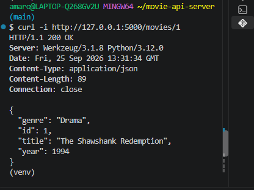
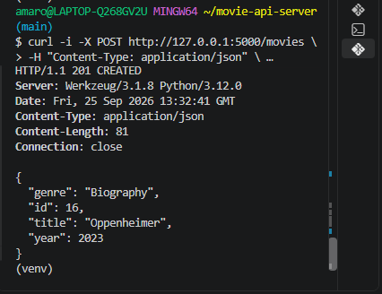
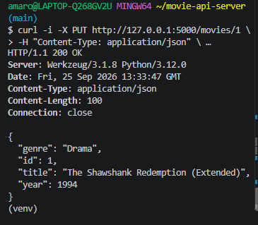
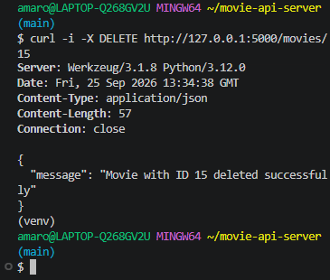

# Albacete_movie-api-server

# Movie REST API Server

A simple Flask REST API managing a movie dataset stored in SQLite.

## Endpoints

| Method | Endpoint | Description | Status Codes |
|---|---|---|---|
| GET | `/movies` | Fetch all movies | 200 |
| GET | `/movies/:id` | Fetch movie by ID | 200, 404 |
| POST | `/movies` | Create a movie | 201, 400 |
| PUT | `/movies/:id` | Update a movie | 200, 400, 404 |
| DELETE | `/movies/:id` | Delete a movie | 200, 404 |

## Sample Request & Response

### POST /movies
**Request:**
`POST /movies`
`Content-Type: application/json`
```json
{
  "title": "Oppenheimer",
  "year": 2023,
  "genre": "Biography"
}

## API Testing Screenshots

### GET Single Item (200 OK)


### POST Create Item (201 Created)


### PUT Update Item (200 OK)


### DELETE Item (200 OK)



## Live API URL (Bonus)
https://albacete-movie-api-server-1.onrender.com/movies