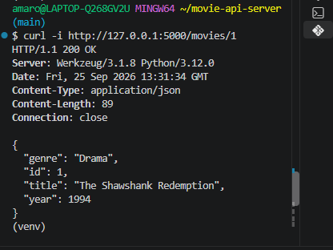
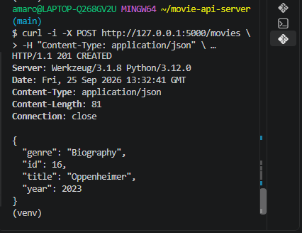
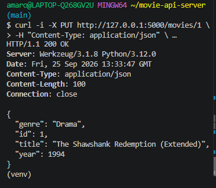
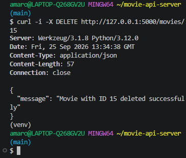

# Movie REST API Server

A simple Flask REST API managing a movie dataset stored in SQLite.

## Run the app

The dark CiNeMooore frontend is served by Flask alongside the API. Open `http://127.0.0.1:5000` to browse and manage the movie collection. Because the frontend and API use the same origin, no separate CORS configuration or frontend server is needed.

### Windows

```powershell
python -m venv venv
venv\Scripts\Activate.ps1
pip install -r requirements.txt
```

### macOS / Linux

```bash
python3 -m venv venv
source venv/bin/activate
pip install -r requirements.txt
```

Initialize the database (this creates it if needed and adds any missing starter movies without duplicating existing titles), then start Flask:

```bash
python init_db.py
python app.py
```

Visit `http://127.0.0.1:5000`. The app supports searching the collection, viewing a movie by ID, adding, editing, deleting, and displaying API validation and not-found errors. Real film-poster thumbnails are retrieved from Wikipedia/Wikimedia on first load and cached in the browser; an internet connection is needed to fetch them initially. The detail view links to the poster's Wikipedia article. No API key is required. You can safely rerun `python init_db.py` to add any missing starter titles.

The frontend source is in the `frontend/` folder. `app.py` serves it at `/` and serves its CSS and JavaScript under `/assets/`.

## Endpoints

| Method | Endpoint | Description | Status Codes |
|---|---|---|---|
| GET | `/movies` | Fetch all movies | 200 |
| GET | `/movies/:id` | Fetch movie by ID | 200, 404 |
| POST | `/movies` | Create a movie | 201, 400 |
| PUT | `/movies/:id` | Update a movie | 200, 400, 404 |
| DELETE | `/movies/:id` | Delete a movie | 200, 404 |

## Sample Request & Response

### POST /movies
**Request:**
`POST /movies`  
`Content-Type: application/json`

```json
{
  "title": "Oppenheimer",
  "year": 2023,
  "genre": "Biography"
}
```

**Response (201 Created):**
```json
{
  "id": 16,
  "title": "Oppenheimer",
  "year": 2023,
  "genre": "Biography"
}
```

## API Testing Screenshots

### GET Single Item (200 OK)


### POST Create Item (201 Created)


### PUT Update Item (200 OK)


### DELETE Item (200 OK)


## Live API URL (Bonus)
https://albacete-movie-api-server-1.onrender.com/movies